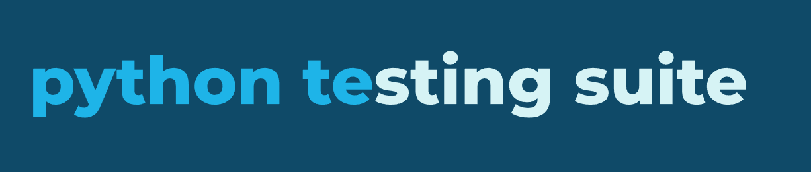

# 🧪 Python Test Automation Suite


This repository provides a **Windows-based automation toolkit** for running Python tests, generating **coverage reports**, and performing **static type checking** using batch scripts.

It's ideal for Python developers who want a lightweight, no-frills test automation system that works out-of-the-box on Windows environments.

---

## 📦 Features

- 🔍 **Run Pytest** with detailed logging
- 📊 **Code coverage reports** in:
  - Plain text
  - Markdown
  - HTML
- 🧠 **Static type checking** with `mypy` (or your preferred checker)
- 🗂️ Organized report directories with date and time stamps
- 🖥️ Batch script-based automation — no CI setup required

---

## 📁 Project Structure

```

├── run-pytest.bat          # Runs pytest with verbose output and generates HTML report
├── run-coverage.bat        # Runs tests with coverage analysis and creates TXT, MD, and HTML reports
├── run-type-checker.bat    # (You can explain this script if provided)
├── test-requirements.txt   # List of required packages for running tests
```